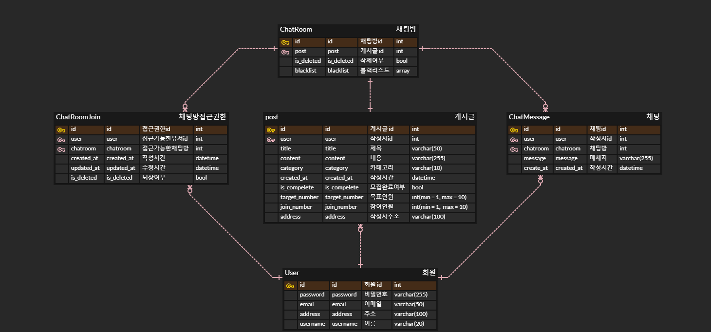

# 밀버디🍚

- 다양한 사용자들이 음식 주문을 결합하여 배달비를 절감하고, 주문 과정을 더 효율적으로 만드는 웹사이트 개발.
- 사용자는 개인 정보를 등록하고 로그인하여 서비스를 이용.
- 게시글 확인 및 채팅 참여기능을 통해 소통.
- 메뉴 추천기능과 날씨정보를 통한 메뉴 선정에 도움.

## 📖 프로젝트 소개 및 계획이유

- 프로젝트 소개
  > - 다양한 사용자들이 음식 주문을 결합하여 배달비를 절감하고, 주문 과정을 더 효율적으로 만드는 웹사이트 개발.
  > - 사용자는 개인 정보를 등록하고 로그인하여 서비스를 이용.
  > - 게시글 확인 및 채팅 참여기능을 통해 소통.
  > - 메뉴 추천기능과 날씨정보를 통한 메뉴 선정에 도움.
- 프로젝트 계획이유
  > 높아져 가는 배달비로 인해 배달을 시키는데에 부담이 발생하고,  
  > 최소금액이 존재하여 내가 먹을 양보다 많은 양을 시키게 되고 그로 인해 원하지 않은 많은 음식물 쓰레기와 지출이 발생합니다.  
  > 또한, 알뜰 배달이라는 서비스가 존재하지만 긴 배달시간으로 인해 음식이 식거나 형태가 변형되는 경우가 발생하여 이와 같은 문제로 인해 느끼는 불편함을 해소하고자 계획하였습니다.

## 🕰 개발 기간

> 2023.08.17 ~ 2023.09.04

## 🤝 멤버 구성

- 김바름 - django channels를 이용한 채팅기능 구현, open API 연동, 프론트엔드 구현, docker-compose를 통한 배포
- 김범석 - JWT를 이용해 로그인, 회원가입 기능 구현, API 명세서 작성, README 작성
- 류형환 - 게시글 CRUD 구현, 주소와 카테고리 별 필터기능 구현
- 임동성 - USER 관련 정보 수정 기능 구현, 다음 주소 API 연동

## 📕 배포 주소

- https://mealbuddy.space/

- 테스트 계정

```
Email : test@test.com
Password : password123
```

- [프론트엔드 레포지토리](https://github.com/Group-buying-service/mealbuddy-front)

## ⚙ 기술 스택

       

## 📌 주요 기능

- 메뉴 추천
- 지역기반 배달 공동구매 중개
- 주민간의 채팅 서비스
- 지역 날씨 정보 확인

## 🚩 API 명세서

[API 명세서](https://github.com/Group-buying-service/mealbuddy-backend/blob/main/API%20%EB%AA%85%EC%84%B8%EC%84%9C.md)

## 🚩 API 경로

**백엔드**  
- prefix: `/api`

|URL|기능|
|---|---|
|`/user/login/`|로그인|
|`/user/register/`|회원가입|
|`/user/delete/`|회원탈퇴|
|`/user/changepassword/`|비밀번호 변경|
|`/user/update/`|유저정보 수정|
|`/user/current/`|유저정보 확인|
|`/post/`|글 목록 조회|
|`/post/detail/<post_id>/`|글 상세 조회|
|`/post/write/`|글 작성|
|`/post/detail/<post_id>/edit/`|글 수정|
|`/post/detail/<post_id>/delete/`|글 삭제|
|`/chat/<room_id>/`|채팅방 상태 조회, 채팅방 접근권한 얻기, 채팅방 삭제|
|`/chat/<room_id>/user/`|채팅방 유저 조회, 채팅방 나가기|
|`/chat/<room_id>/user/ban/`|채팅방 유저 강퇴|
|`/openAPI/weather/`|날씨 정보 조회|
|`/openAPI/foodchoicer/`|음식 추천|

## 🛢데이터베이스 설계



## 🖥 화면 구성

|   **회원가입**  |
|:---------------:|
||
|   **회원가입(오류처리)**  |
||
|   **로그인**   |
||
|   **음식추천 및 날씨정비**   |
||
|   **회원정보 수정**   |
||
|   **회원탈퇴**   |
||
|   **글 작성**   |
||
|   **글 수정**   |
||
|   **모집상태 변경 및 삭제**   |
||
|   **게시판**   |
||
|   **채팅**   |
||
|   **에러페이지**   |
||

## 🗜 아키텍쳐

### 디렉토리 구조

```
📦mealbuddy-backend
│  .env
│  manage.py
│  README.md
│  requirements.txt
├─chat
│  │  admin.py
│  │  apps.py
│  │  consumers.py
│  │  models.py
│  │  routing.py
│  │  serializer.py
│  │  signal.py
│  │  urls.py
│  │  views.py
│  └─migrations
│     │  0001_initial.py
│     └  0002_initial.py    
├─core
│  │  exceptions.py
│  └─models.py        
├─group_buying_service
│  │  asgi.py
│  │  settings.py
│  │  urls.py
│  │  views.py
│  │  wsgi.py
│  ├─API
│  │  │  openAI.py
│  │  └─ weather.py
│  └─utils
│     │  coordinate_convert.py
│     └─ paginator.py
├─openAPI
│  │  apps.py
│  │  urls.py
│  └─views.py
├─post
│  │  admin.py
│  │  apps.py
│  │  models.py
│  │  serializers.py
│  │  signal.py
│  │  tests.py
│  │  urls.py
│  │  views.py
│  └─migrations
│     │  0001_initial.py
│     └─0002_initial.py
└─user
   │  admin.py
   │  apps.py
   │  backends.py
   │  managers.py
   │  models.py
   │  permissions.py
   ├─api
   │  │  renderers.py
   │  │  serializers.py
   │  │  urls.py
   │  └─ views.py      
   └─migrations
      └─0001_initial.py
```

## 💡 개발 중 장애 및 극복 방법

### WebSocket 과 JWT

웹 소켓 방식으로 통신을 할 시, 기본적으로 지원하는 미들웨어에서는 세션방식의 인증을 지원하고 있어서, 중간에 JWT를 인증하는 미들웨어를 새로 만들어서 인증을 하도록 로직을 구현했습니다. 하지만 자바스크립트의 WebSocket API 에서는 header를 따로 구성할 수가 없어서 get방식으로 토큰을 보낸 후 이를 이용하도록 하였는데, 이 부분에서 더 안전한 방법이 없는지 조금 더 공부해가는 과정이 필요할 것 같습니다.

### ASGI 배포과정에서의 문제

채팅기능을 이용하기 위해서 django-channels와 daphne를 이용한 ASGI 프로토콜으로 통신을 하게 되었습니다. runserver 환경에서는 정상적으로 작동하였지만, 실제 배포 환경에서는 daphne를 따로 실행하는 방식으로 구현을 하였는데, daphne가 정상적으로 실행되지 않는 현상이 발생하였습니다.
이를 해결하기 위해서 로그를 확인해보고, 두가지 문제점을 발견했습니다. 
첫번째는 개발을 진행했던 window 환경과는 다르게 EC2의 ubuntu 환경에서는 os.environ.setdefault 명령어가 정상적으로 작동하지 않는 것이었습니다. 이를 해결하기 위해서 docker-compose.yml 파일에서 environ을 설정해주는 방식을 이용하였습니다.
두번째로는 모듈을 import 하는 순서에 문제가 있었습니다. runserver로 개발 서버를 실행할때는 django가 로딩 된 후 asgi application과 daphne가 연결되지만 daphne를 따로 실행 할 경우에는 asgi apllication의 위치에 따라서 모듈을 import 하는데 문제가 생기는 것을 확인했습니다. 이를 해결하기 위해 asgi.py 파일내의 다른 모듈들을 get_asgi_application 메서드가 실행 된 후에 import 되도록 변경하였습니다.

### React 프로젝트의 빌드

docker compose를 이용하면서, nginx가 빌드될 때, mealbuddy-frontend 의 파일들을 이용해서 빌드를 진행한 후에, 생성된 build 폴더를 nginx의 /usr/share/nginx/html 경로에 복사해서 nginx 가 빌드된 리액트 파일을 서빙하도록 구현하려고 하였으나, 이렇게 진행할 경우 빌드에 너무나도 긴 시간이 걸리고, 중간에 EC2 인스턴스가 멈춰버리는 문제가 발생하였습니다. 
문제의 원인을 찾기 위해서 ubuntu에서 top 명령어를 이용해보니, nginx의 빌드 명령이 실행되면 docker-compose가 메모리를 전부 차지하는것을 알게 되었습니다.
이를 해결하기 위해서 로컬환경에서 빌드한 이후에, nginx의 빌드 명령이 실행될때는 빌드된 정적 파일을 복사만 하는 구조로 변경하였습니다. 추후에는 EC2 인스턴스의 사양을 업그레이드하거나, 다른 더 효율적인 빌드 방법을 확인해보고 적용해보는 과정이 필요할 것 같습니다.

## 💡추가 및 리서치 하고 싶은 기능

1. 결제금액을 충전 및 포인트 적립 시스템 추가.  
    중개 역할을 넘어서, 배달에 필요한 금액을 미리 지불해서 배달 공동 구매 서비스가 원할하게 진행될 수 있도록 하고 싶습니다.  
    
2. 배달음식을 넘어서 동네 주민들간의 여가생활 커뮤니티를 연결.  
    같은 지역 주민들 끼리 이용할 수 있는 서비스인 만큼, 커뮤니티 기능을 더 추가해서 동네간의 정보도 공유할 수 있는 서비스로 만들고 싶습니다.  

3. 모바일 서비스 지원  
    현재 페이지는 반응형을 지원하지 않는데, 서비스의 특성 상 모바일환경에 더 적합하므로, 모바일도 지원하도록 서비스를 변경하고 싶습니다.  

4. 프로필 테이블을 분리하고 기능 추가.  
    프로필 테이블을 분리해서 사용자의 성별등의 추가적인 정보를 받아서 메뉴추천등의 기능에 사용할 수 있도록 하고, 프로필 이미지를 추가해서 S3등의 외부 저장소를 이용하는 기능도 추가하고 싶습니다.  

5. 웹소켓을 이용한 참여한 채팅리스트 기능 및 업데이트 알림기능 추가.  
    채팅 서비스인 만큼, 현재 참여한 채팅리스트 기능과, 채팅이 업데이트 되면 알림이 되는 기능을 추가할 예정입니다.  
    ChatRoomJoin 테이블을 이용해서 채팅방이 업데이트 되었다는 상태를 저장하고, 채팅리스트를 관리하는 웹소켓과 django siginal기능을 이용해서 관리하는 로직으로 고려하고 있습니다.  

6. 소셜 로그인 추가 및 JWT 로그인방식 고도화.  
    현재 로그인기능은 PyJWT를 이용해서 access token 만 발급하는 형태인데, simple_jwt를 이용해서 access, refresh token을 모두 관리하는 방식으로 바꾸고, oAuth등의 추가적인 패키지를 이용한 소셜로그인 기능의 추가도 고려하고 있습니다.

 ## 💡 후기

- 김바름
  > Channels를 이용한 web socket 통신이나, docker를 이용한 배포과정 등을 처음 경험해봤는데, 작업과정에서 발생하는 관련 오류를 수정해가면서 channels나 docker에 대해서도 이해할 수 있는 좋은 기회였습니다. 또한 팀프로젝트에서 각자의 코드작성 예상시간과 실제시간의 차이가 많이 나서, 전체적인 일정이 복잡해졌는데, 이러한 관리의 중요성에 대해서도 알 수 있었습니다. 그리고 협업에서 branch 전략을 제대로 이용해본것은 처음인데, 머지과정에서 발생하는 충돌을 해결해보고, 풀 리퀘스트의 코드를 보고 서로 의견을 주고받는것도 정말 좋은 경험이었습니다.
- 김범석
  > JWT를 이용해 토큰을 관리하는 것을 이해하는 것이 조금 어려웠었고, 팀프로젝트로 협업하는 것이 처음이라 서투르다보니 문제점이 많았었습니다.  
  > 다른 팀원들에게 정말 많이 배웠고 제대로 팀프로젝트를 진행한 것이 처음이라서 새로운 경험을 할 수 있었습니다. 이를 통해 django drf와 git을 다루는 데에 익숙해져서 스스로가 조금 더 성장한 시간이었습니다.
- 류형환
  > 프론트가 없는 상태에서 기능만 개발하다 보니 기능이 완성되어도 데이터가 정상적으로 주고받고 데이터 처리를 확인하는 작업이 어색하여 어려웠습니다.  
  > drf가 무엇인지 조금이나마 아는 시간이 되었고 깃허브를 이용하여 팀과 협업을 한 경우가 이번이 처음이었는데 깃허브를 다루는 게 조금이나마 익숙해지는 시간이었던 거 같습니다.
- 임동성
  > 로그인과정에서의 token개념에 대해서 이해가 어려웠었고 django에 대해서 익숙해 지기가 어려웠습니다.  
  > 협업의 중요성에 대해서 깨닫게 되고 drf에서 사용되는 Serializer의 구조에 대해서 좀 더 직관적으로 알게되었습니다.
